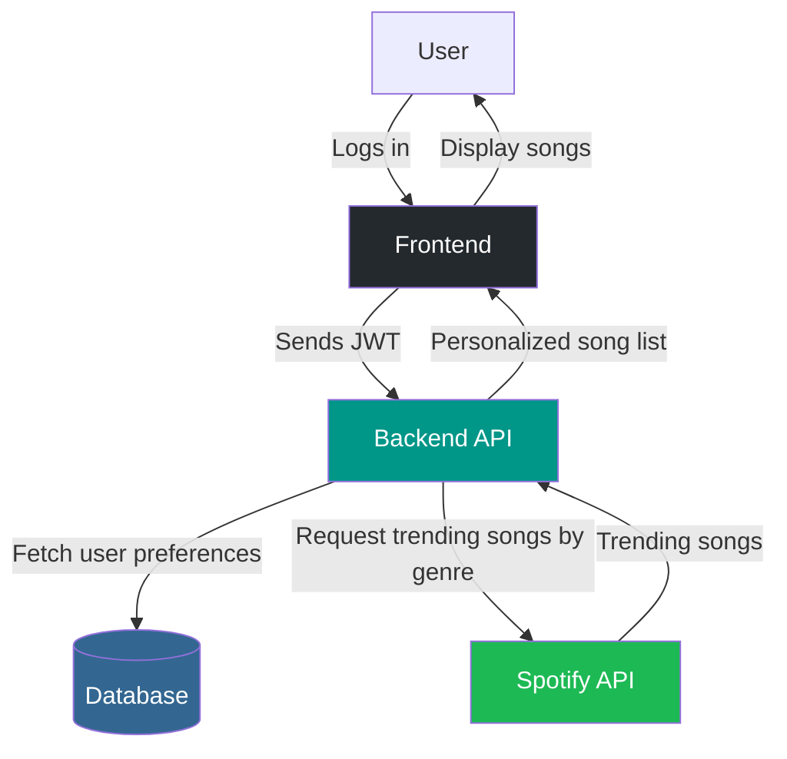

# API Development

## Overview

This project uses two main API strategies:

1. **External API Integration**: We use the Spotify Web API to fetch trending and relevant song metadata, previews, and other music-related data. The API allows us to personalize results: for example, if a user prefers rap music, we fetch trending rap songs for that user. Only preview URLs (not full tracks) are used, in compliance with Spotify's terms.

2. **Internal API**: We provide our own RESTful API (built with FastAPI) to serve music, playlists, and user data to our frontend clients. This API handles authentication, user management, playlist operations, and streaming or serving music files stored in our Supabase S3 bucket.

---

## External API: Spotify Web API

- Used for fetching trending and personalized songs, metadata, and preview URLs.
- Requires OAuth authentication with Spotify.
- Data fetched is cached in Redis for performance.
- Only preview URLs are used; full tracks are not downloaded or stored.
- Personalization: User preferences (e.g., genre, artists) are used to fetch relevant trending songs.

## Internal API: FastAPI Backend

- Exposes endpoints for:
  - User authentication and profile
  - Playlist management (create, update, delete, share)
  - Song management (favorites, add to playlist, etc.)
  - Music streaming/download (from Supabase S3 bucket)
- Secured with JWT tokens (Auth0 integration)
- Returns JSON responses for frontend consumption

---

## Admin Dashboard (Planned)

- An admin dashboard will be built to allow administrators to upload and manage music files in the Supabase S3 bucket.
- Only music files uploaded by the admin will be available for full streaming to users.
- This ensures all music distributed is properly licensed and managed.

---

## Example API Endpoints

### External (Spotify)

- `GET /trending?genre=rap` (fetch trending rap songs for user)
- `GET /tracks/{id}` (get song details)

### Internal (FastAPI)

- `POST /auth/login` (user login)
- `GET /playlists` (list user playlists)
- `POST /playlists` (create playlist)
- `GET /songs/{id}` (get song info)
- `GET /songs/{id}/stream` (stream audio)

---

## Security

- All internal endpoints require JWT authentication.
- Rate limiting and input validation are enforced.

---

## Future Improvements

- Add GraphQL endpoints for more flexible queries.
- WebSocket support for real-time updates.
- Admin dashboard for music management.

---

## Personalized Song Fetching Flow

---

This diagram illustrates how the system fetches trending and relevant songs for each user:

- The user logs in and their preferences (such as favorite genres) are retrieved from the database.
- The backend uses these preferences to request trending songs of the relevant genre from the Spotify API.
- Only preview URLs and metadata are returned from Spotify (no full tracks).
- The backend sends a personalized list of trending songs to the frontend, which displays them to the user.

All full-length music available for streaming is managed and uploaded by the admin via the internal dashboard and stored in the Supabase S3 bucket.
