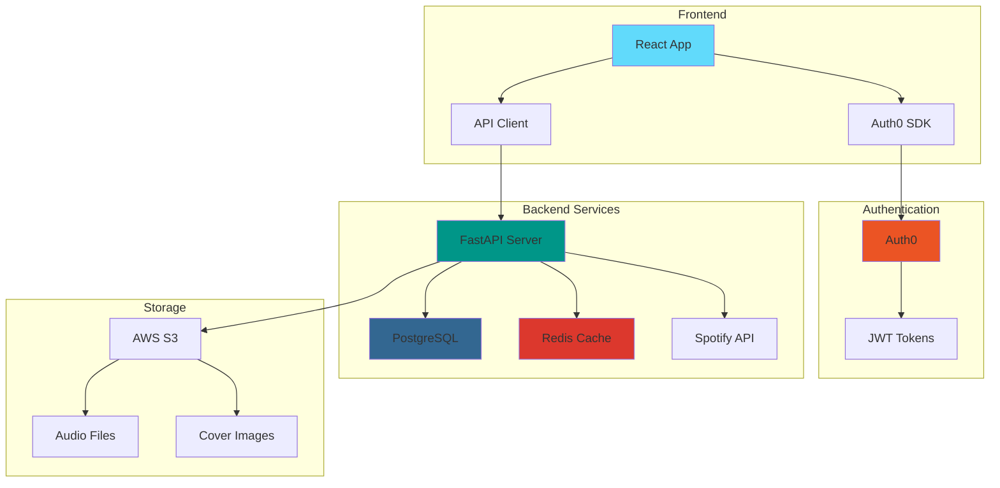
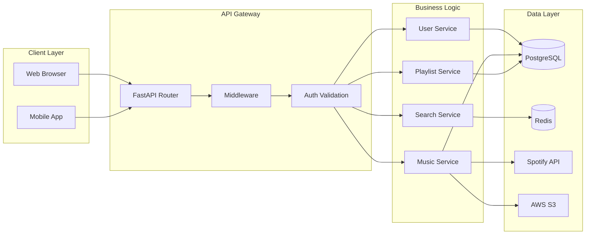
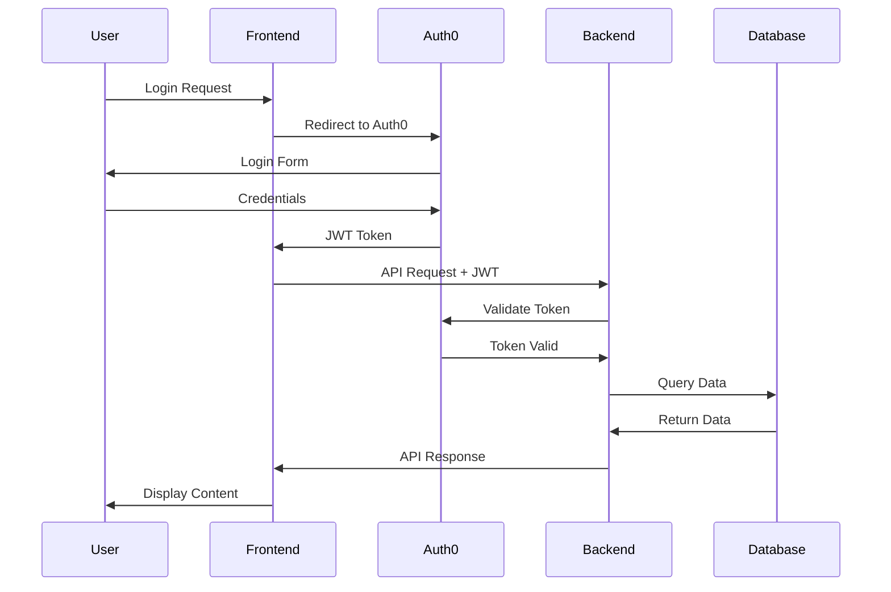
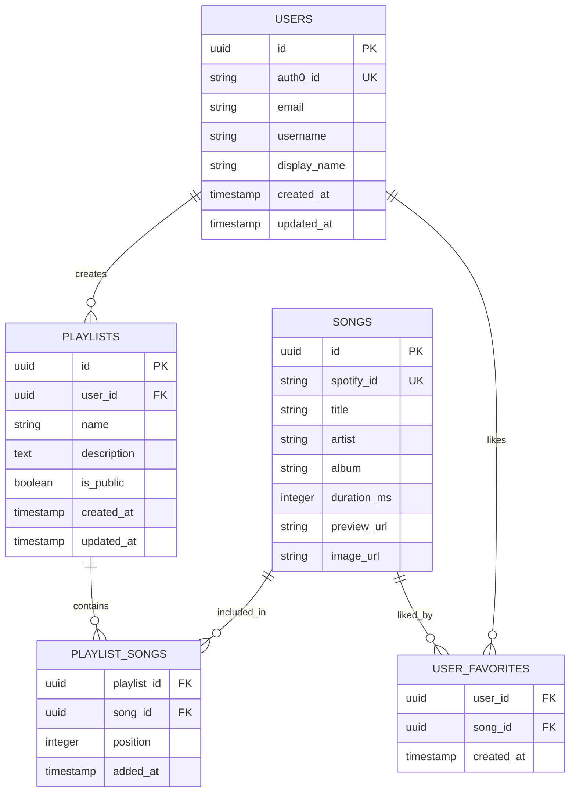

# Arkitektura e Sistemit

## Përmbledhje e Arkitekturës

## Diagrami i Komponentëve

## Rrjedha e Autentifikimit

## Arkitektura e Bazës së të Dhënave

## Teknologjitë e Përdorura

### Frontend Stack
- **React 18** - UI Framework
- **TypeScript** - Type Safety
- **Tailwind CSS** - Styling
- **Auth0 React SDK** - Authentication
- **React Query** - State Management & Caching
- **React Router** - Navigation

### Backend Stack
- **Python 3.8+** - Programming Language
- **FastAPI** - Web Framework
- **SQLAlchemy** - ORM
- **Alembic** - Database Migrations
- **Pydantic** - Data Validation
- **python-jose** - JWT Handling

### Infrastructure
- **PostgreSQL** - Primary Database
- **Redis** - Caching & Sessions
- **AWS S3** - File Storage
- **Auth0** - Authentication Service
- **Spotify Web API** - Music Metadata

### Development Tools
- **Docker** - Containerization
- **pytest** - Testing Framework
- **Black** - Code Formatting
- **Flake8** - Linting
- **pre-commit** - Git Hooks