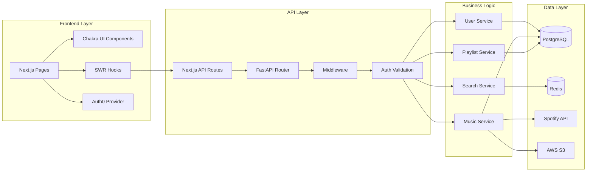
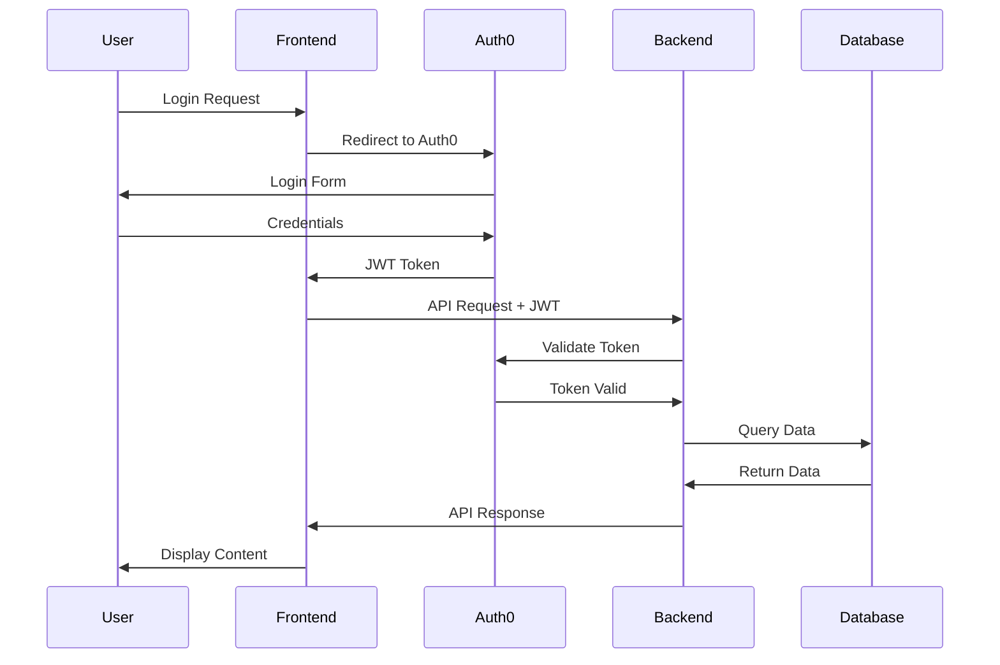
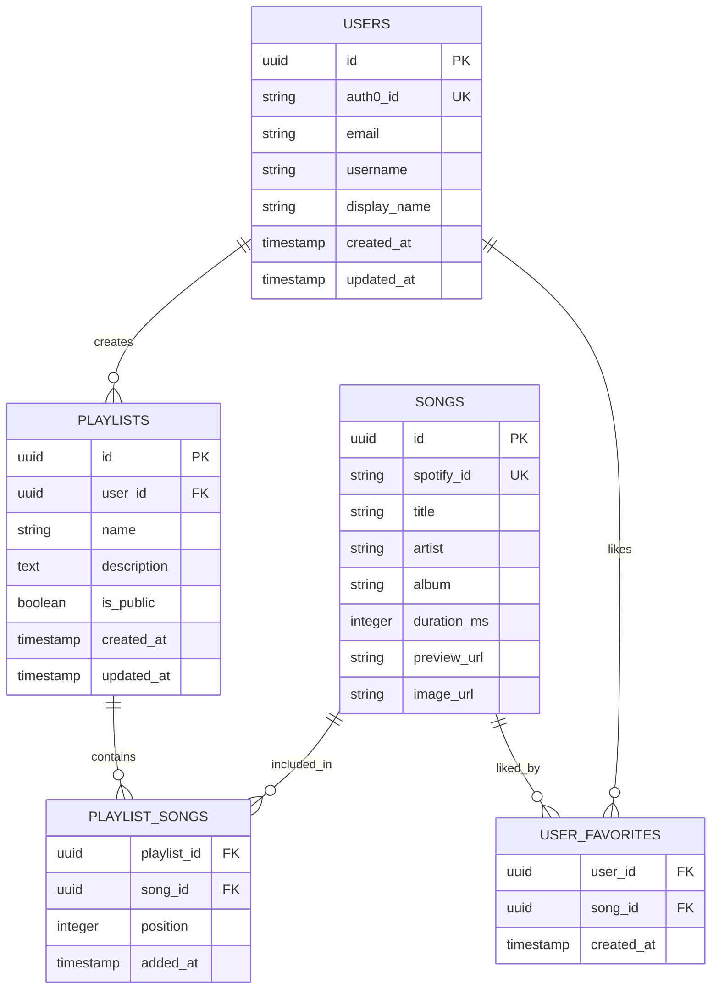

# Arkitektura e Sistemit

## Përmbledhje e Arkitekturës

```mermaid
graph TB
    subgraph "Frontend (Next.js)"
        A[Next.js App] --> B[Auth0 Next.js SDK]
        A --> C[SWR Client]
        A --> D[Chakra UI Components]
        E[API Routes] --> F[Server Actions]
    end
    
    subgraph "Authentication"
        G[Auth0] --> H[JWT Tokens]
    end
    
    subgraph "Backend Services"
        I[FastAPI Server] --> J[PostgreSQL]
        I --> K[Redis Cache]
        I --> L[Spotify API]
    end
    
    subgraph "Storage"
        M[AWS S3] --> N[Audio Files]
        M --> O[Cover Images]
    end
    
    B --> G
    C --> I
    E --> I
    I --> M
    
    style A fill:#000000
    style I fill:#009688
    style G fill:#eb5424
    style J fill:#336791
    style K fill:#dc382d
    style D fill:#319795
```

## Diagrami i Komponentëve

## Rrjedha e Autentifikimit

## Arkitektura e Bazës së të Dhënave

## Teknologjitë e Përdorura

### Frontend Stack
- **Next.js 13+** - React Framework (App Router)
- **TypeScript** - Type Safety
- **Chakra UI** - Component Library
- **Auth0 Next.js SDK** - Authentication
- **SWR** - Data Fetching & Caching
- **Framer Motion** - Animations
- **React Hook Form** - Form Management

### Backend Stack
- **Python 3.8+** - Programming Language
- **FastAPI** - Web Framework
- **SQLAlchemy** - ORM
- **Alembic** - Database Migrations
- **Pydantic** - Data Validation
- **python-jose** - JWT Handling

### Infrastructure
- **PostgreSQL** - Primary Database
- **Redis** - Caching & Sessions
- **AWS S3** - File Storage
- **Auth0** - Authentication Service
- **Spotify Web API** - Music Metadata

### Development Tools
- **Docker** - Containerization
- **pytest** - Testing Framework
- **Black** - Code Formatting
- **Flake8** - Linting
- **pre-commit** - Git Hooks