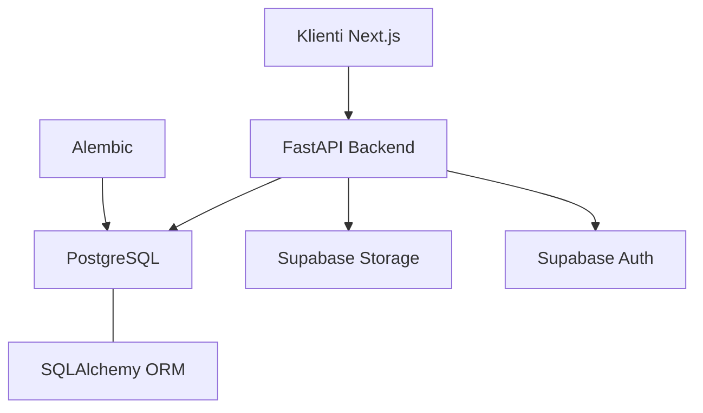

# Struktura dhe Arkitektura e Bazës së të Dhënave

## Përmbledhje

Projekti përshtat një arkitekturë moderne dhe të sigurt për ruajtjen e të dhënave, duke kombinuar fuqinë e **PostgreSQL** si bazë të dhënash relacionale dhe **Supabase Storage** për ruajtjen e skedarëve audio dhe imazheve.

## Komponentët Kryesorë

1.  **PostgreSQL**: Motori kryesor i bazës së të dhënave që ruan metadata, informacionin e përdoruesve, listat e luanjes dhe pëlqimet.
2.  **Supabase Auth**: Përdoret për menaxhimin e identitetit dhe autentifikimin e sigurt.
3.  **Supabase Storage**: Përdoret për ruajtjen e:
    *   Skedarëve audio (`songs` bucket)
    *   Imazheve të kapakëve (`covers` bucket)
    *   Avatareve të përdoruesve (`avatars` bucket)

## Arkitektura e Nivelit të Lartë

## Parimet e Dizajnit

*   **Identifikues Unik (UUID)**: Çdo rekord përdor UUID si çelës primar (`PRIMARY KEY`) për të garantuar siguri dhe lehtësi në shpërndarjen e të dhënave.
*   **Integriteti Referencial**: Përdorimi i rreptë i `FOREIGN KEY` me rregulla `ON DELETE CASCADE` ose `SET NULL` për të mbajtur bazën të pastër.
*   **Audit Trail**: Çdo tabelë përmban kolona `created_at` dhe `updated_at` (ku aplikohet) për të gjurmuar historikun e të dhënave.
*   **Siguria në Nivel Rreshti (RLS)**: Përdorimi i rregullave RLS të Supabase për të izoluar të dhënat e përdoruesve në nivel baze të dhënash.
