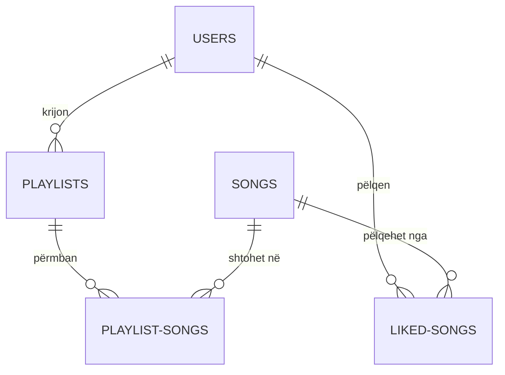

# Marrëdhëniet ndërmjet Tabelave

Baza e të dhënave ndjek një strukturë relacionale të mirë-përcaktuar për të siguruar integritetin e të dhënave.

## Diagrami i Marrëdhënieve (ERD)

## Detajet e Lidhjeve

### 1. Një-me-Shumë (1:N)

*   **Përdoruesit te Playlists**: Një përdorues mund të ketë shumë lista luanje, por një listë luanje (në termat e pronësisë) i përket vetëm një përdoruesi.
*   **Përdoruesit te Liked Songs**: Një përdorues mund të pëlqejë shumë këngë.

### 2. Shumë-me-Shumë (N:M)

*   **Playlists te Songs**:
    *   Një playlist mund të përmbajë shumë këngë.
    *   Një këngë mund të gjendet në shumë playlist-e të ndryshme.
    *   Kjo marrëdhënie zgjidhet përmes tabelës lidhëse `playlist_songs`.
    *   Fusha `position` siguron renditjen e këngëve brenda playlist-it.

### 3. Integriteti Referencial

*   **ON DELETE CASCADE**: Ne përdorim kryesisht fshirjen kaskadë.
    *   Nëse fshihet një `user`, fshihen të gjitha listat e tij të luanjes dhe këngët e pëlqyera.
    *   Nëse fshihet një `playlist`, fshihen rekordet përkatëse në `playlist_songs` (por jo këngët vetë).
    *   Nëse fshihet një `song`, ajo hiqet automatikisht nga të gjitha listat e luanjes dhe pëlqimet.
